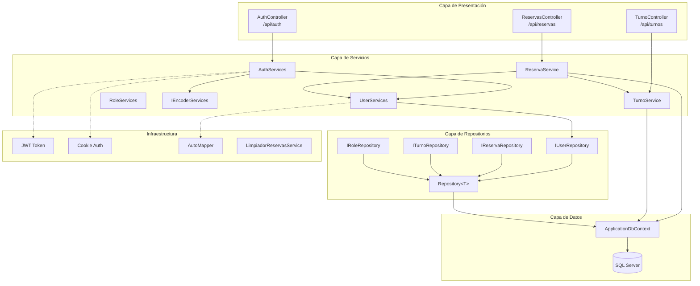
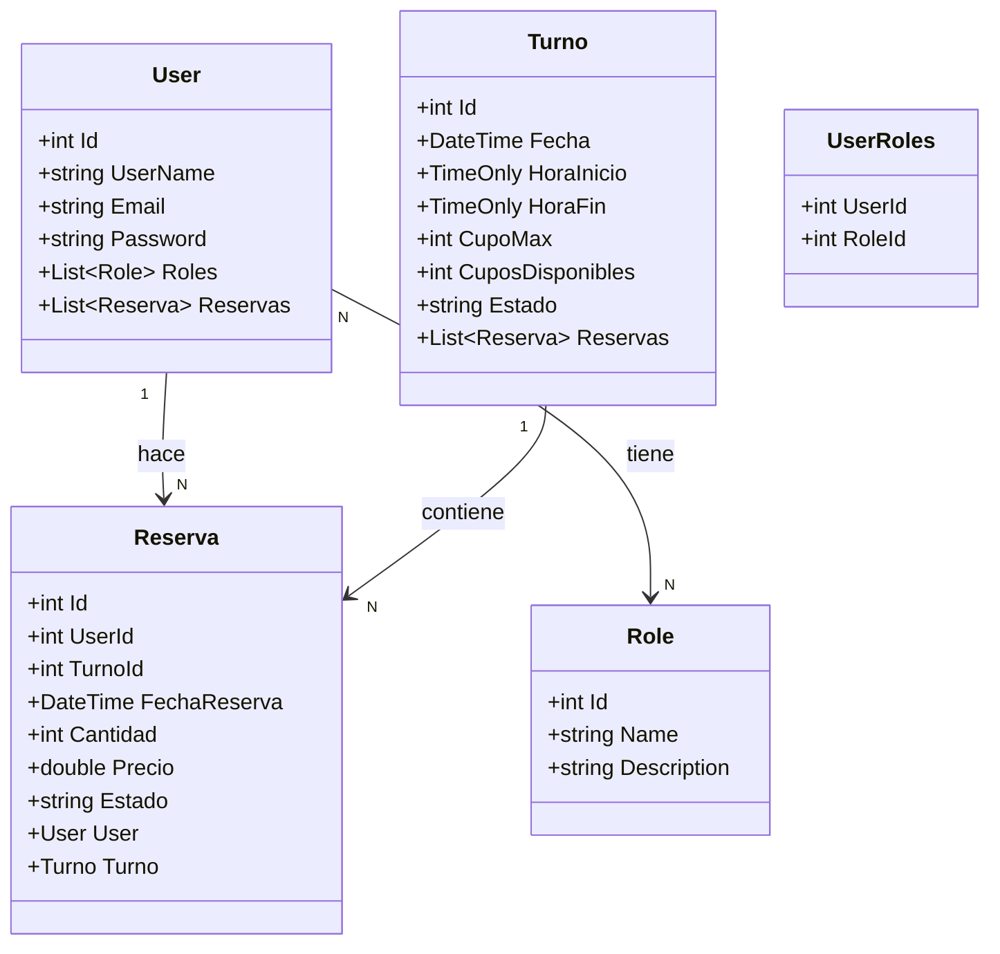
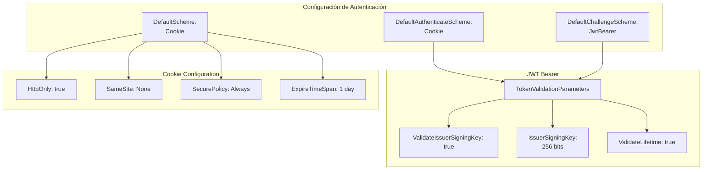
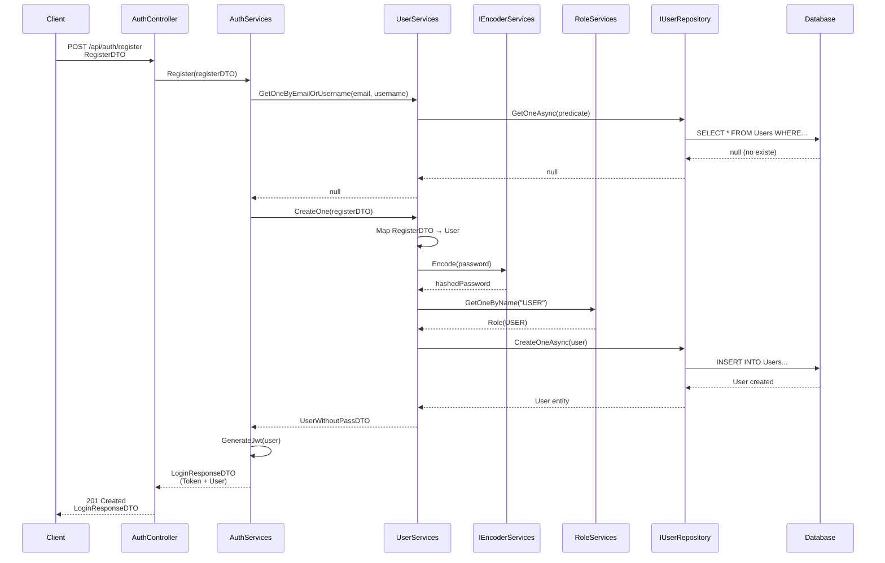
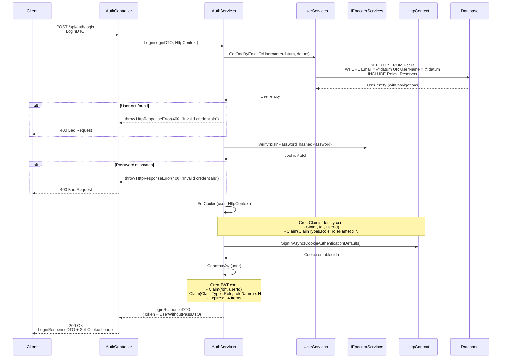
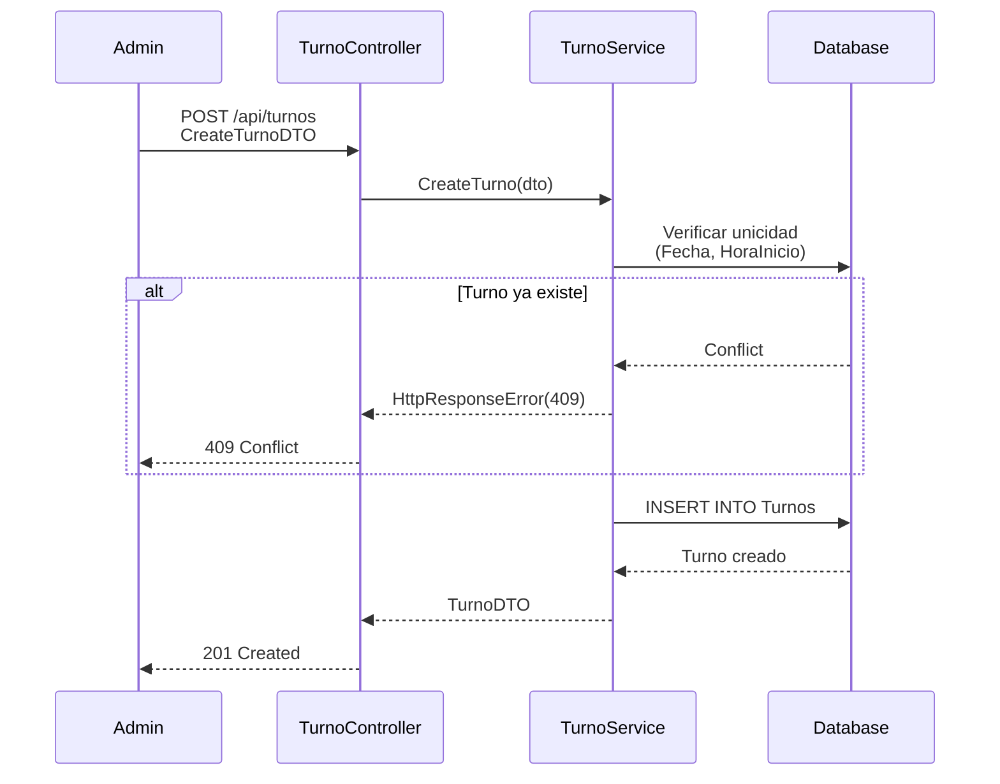
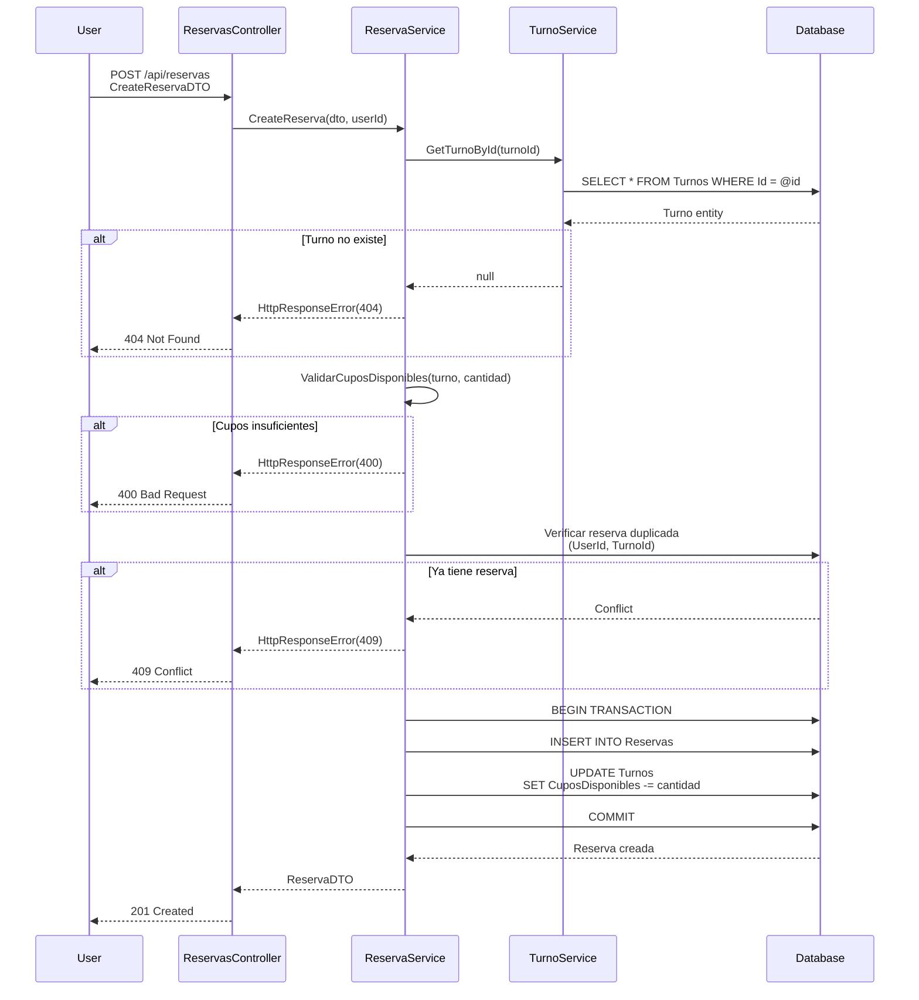

# Documentación Técnica del Backend - Sistema de Reservas Sky Jump Park

## Resumen Ejecutivo

El backend es una API REST construida en ASP.NET Core que implementa un sistema de gestión de reservas con autenticación dual (JWT + Cookies), autorización basada en roles, y arquitectura en capas.

---

## Arquitectura General del Sistema

### Diagrama de Capas



---

## Diagrama de Clases - Modelo de Dominio

### Entidades Principales



### Relaciones y Restricciones

Las relaciones están configuradas en `ApplicationDbContext.OnModelCreating`:

**Restricciones Clave:**

- **Unique Index**: `User.UserName`, `User.Email`, `Role.Name`
- **Composite Unique**: `(UserId, TurnoId)` en Reserva, `(Fecha, HoraInicio)` en Turno
- **Delete Behavior**: `Restrict` para prevenir eliminaciones en cascada

---

## Sistema de Seguridad

### 1. Autenticación Dual (JWT + Cookies)

El sistema implementa **dos mecanismos de autenticación simultáneos** para máxima compatibilidad:



#### Configuración JWT

**Parámetros de Validación:**

- `ValidateIssuerSigningKey: true` - Valida la firma del token
- `IssuerSigningKey` - Clave simétrica de 256 bits (mínimo 32 caracteres)
- `ValidateLifetime: true` - Verifica expiración del token (24 horas)
- `ValidateIssuer: false` - No valida emisor (single-tenant)
- `ValidateAudience: false` - No valida audiencia (single-tenant)

#### Configuración de Cookies

**Propiedades de Seguridad:**

- `HttpOnly: true` - Previene acceso desde JavaScript (protección XSS)
- `SameSite: None` - Permite cookies cross-site (necesario para CORS)
- `SecurePolicy: Always` - Solo transmite por HTTPS
- `ExpireTimeSpan: 1 día` - Duración de la sesión

---

### 2. Flujo de Autenticación - Registro



**Pasos del Registro:**

1. Validar que email/username no existan
2. Mapear DTO a entidad `User`
3. Hashear contraseña con BCrypt (via `IEncoderServices`)
4. Asignar rol por defecto "USER"
5. Persistir en base de datos
6. Generar JWT token
7. Retornar token + datos de usuario (sin contraseña)

---

### 3. Flujo de Autenticación - Login



**Detalles de Implementación:**

#### Verificación de Contraseña

Usa BCrypt para comparar la contraseña en texto plano con el hash almacenado.

#### Establecimiento de Cookie

**Claims incluidos:**

- `id`: ID del usuario
- `ClaimTypes.Role`: Uno por cada rol asignado (USER, ADMIN, MOD)

**Propiedades de la Cookie:**

- `IsPersistent: true` - Sobrevive al cierre del navegador
- `ExpiresUtc: 24 horas` - Duración de la sesión

#### Generación de JWT

**Estructura del Token:**

- **Header**: Algoritmo HMAC-SHA256
- **Payload**: Claims (id + roles)
- **Signature**: Firmado con clave secreta de 256 bits
- **Expiración**: 24 horas desde emisión

---

### 4. Autorización Basada en Roles

El sistema implementa **Role-Based Access Control (RBAC)** con tres roles predefinidos:

| Rol       | Descripción      | Permisos                                 |
| --------- | ---------------- | ---------------------------------------- |
| **USER**  | Usuario estándar | Crear/ver sus propias reservas           |
| **MOD**   | Moderador        | Gestionar turnos, ver todas las reservas |
| **ADMIN** | Administrador    | Acceso total al sistema                  |

**Implementación en Controllers:**

```csharp
[Authorize(Roles = "ADMIN")]
public class AdminController : ControllerBase { }

[Authorize(Roles = "ADMIN,MOD")]
public IActionResult GestionarTurnos() { }

[Authorize] // Requiere autenticación, cualquier rol
public IActionResult MiPerfil() { }
```

---

## Flujos de Negocio

### 1. Gestión de Turnos



### 2. Creación de Reserva



---

## Características Técnicas Adicionales

### 1. Worker Service - Limpieza de Reservas

```csharp
public class LimpiadorReservasAntiguasService : BackgroundService
{
    // Ejecuta cada 24 horas
    // Elimina reservas con estado "Pendiente"
    // más antiguas de 7 días
}
```

**Configuración:**

- Intervalo: 24 horas
- Criterio: Reservas pendientes > 7 días
- Acción: Soft delete (actualiza Estado a "Cancelada")

### 2. AutoMapper Profiles

**Mapeos configurados:**

- `RegisterDTO` → `User`
- `User` → `UserWithoutPassDTO`
- `CreateTurnoDTO` → `Turno`
- `Turno` → `TurnoDTO`
- `CreateReservaDTO` → `Reserva`
- `Reserva` → `ReservaDTO`

### 3. Manejo de Errores Global

```csharp
public class HttpResponseError : Exception
{
    public HttpStatusCode StatusCode { get; set; }
    public string Message { get; set; }
}
```

Todos los servicios lanzan `HttpResponseError` que es capturado por middleware global para retornar respuestas HTTP consistentes.

### 4. CORS Configuration

```csharp
builder.Services.AddCors(options =>
{
    options.AddPolicy("AllowFrontend", policy =>
    {
        policy.WithOrigins("http://localhost:5173")
              .AllowAnyMethod()
              .AllowAnyHeader()
              .AllowCredentials(); // Para cookies
    });
});
```

---

## Endpoints API

### Auth Controller

| Método | Endpoint             | Autorización | Descripción                  |
| ------ | -------------------- | ------------ | ---------------------------- |
| POST   | `/api/auth/register` | Ninguna      | Registro de nuevo usuario    |
| POST   | `/api/auth/login`    | Ninguna      | Login (retorna JWT + Cookie) |
| POST   | `/api/auth/logout`   | Autenticado  | Cierra sesión                |
| GET    | `/api/auth/me`       | Autenticado  | Datos del usuario actual     |

### Turnos Controller

| Método | Endpoint           | Autorización | Descripción            |
| ------ | ------------------ | ------------ | ---------------------- |
| GET    | `/api/turnos`      | Ninguna      | Lista todos los turnos |
| GET    | `/api/turnos/{id}` | Ninguna      | Obtiene un turno       |
| POST   | `/api/turnos`      | ADMIN, MOD   | Crea nuevo turno       |
| PUT    | `/api/turnos/{id}` | ADMIN, MOD   | Actualiza turno        |
| DELETE | `/api/turnos/{id}` | ADMIN        | Elimina turno          |

### Reservas Controller

| Método | Endpoint                     | Autorización          | Descripción              |
| ------ | ---------------------------- | --------------------- | ------------------------ |
| GET    | `/api/reservas`              | ADMIN, MOD            | Lista todas las reservas |
| GET    | `/api/reservas/mis-reservas` | Autenticado           | Reservas del usuario     |
| GET    | `/api/reservas/{id}`         | Autenticado           | Obtiene una reserva      |
| POST   | `/api/reservas`              | Autenticado           | Crea reserva             |
| PUT    | `/api/reservas/{id}`         | Usuario dueño o ADMIN | Actualiza reserva        |
| DELETE | `/api/reservas/{id}`         | Usuario dueño o ADMIN | Cancela reserva          |

---

## Estructura del Proyecto

```
Backend/
├── Controllers/
│   ├── AuthController.cs
│   ├── ReservasController.cs
│   └── TurnoController.cs
├── Services/
│   ├── AuthServices.cs
│   ├── UserServices.cs
│   ├── ReservaService.cs
│   ├── TurnoService.cs
│   ├── RoleServices.cs
│   └── IEncoderServices.cs
├── Repositories/
│   ├── IUserRepository.cs
│   ├── IReservaRepository.cs
│   ├── ITurnoRepository.cs
│   ├── IRoleRepository.cs
│   └── Repository<T>.cs
├── Models/
│   ├── User.cs
│   ├── Role.cs
│   ├── Reserva.cs
│   └── Turno.cs
├── DTOs/
│   ├── Auth/
│   ├── User/
│   ├── Turno/
│   └── Reserva/
├── Config/
│   ├── ApplicationDbContext.cs
│   └── AutoMapperProfile.cs
├── Utils/
│   └── HttpResponseError.cs
├── Workers/
│   └── LimpiadorReservasAntiguasService.cs
└── Program.cs
```

---

## Consideraciones de Seguridad

1. **Passwords**: Hasheadas con BCrypt (factor de trabajo configurable)
2. **JWT Secret**: Mínimo 256 bits, almacenada en appsettings (usar secretos en producción)
3. **HTTPS Only**: Cookies configuradas con `SecurePolicy.Always`
4. **HttpOnly Cookies**: Protección contra XSS
5. **CORS**: Configurado solo para origins específicos
6. **SQL Injection**: Prevenido por Entity Framework parametrizado
7. **Authorization**: Verificación de roles en cada endpoint sensible

---

## Variables de Entorno Requeridas

```json
{
  "ConnectionStrings": {
    "DefaultConnection": "Server=...;Database=...;Trusted_Connection=True;"
  },
  "Secrets": {
    "JWT": "tu-clave-secreta-de-al-menos-32-caracteres"
  }
}
```

---

## Tecnologías Utilizadas

- **Framework**: ASP.NET Core 8.0
- **ORM**: Entity Framework Core
- **Database**: SQL Server
- **Authentication**: JWT Bearer + Cookie Authentication
- **Password Hashing**: BCrypt.NET
- **Mapping**: AutoMapper
- **API Documentation**: Swagger/OpenAPI

---

## Instalación y Configuración

1. **Clonar repositorio**
2. **Configurar appsettings.json** con connection string y JWT secret
3. **Aplicar migraciones**:
   ```bash
   dotnet ef database update
   ```
4. **Ejecutar**:
   ```bash
   dotnet run
   ```
5. **Acceder a Swagger**: `https://localhost:5001/swagger`

---

## Autor

Sistema desarrollado para Sky Jump Park - Trabajo Práctico Programación 4
