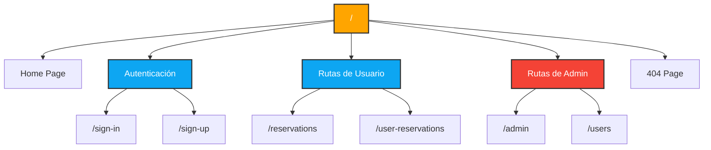
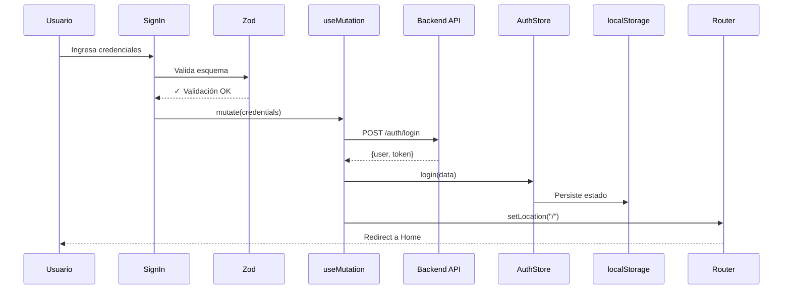
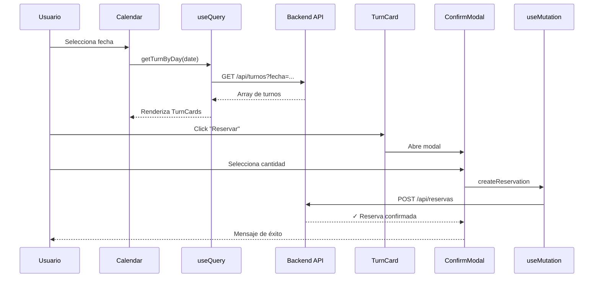
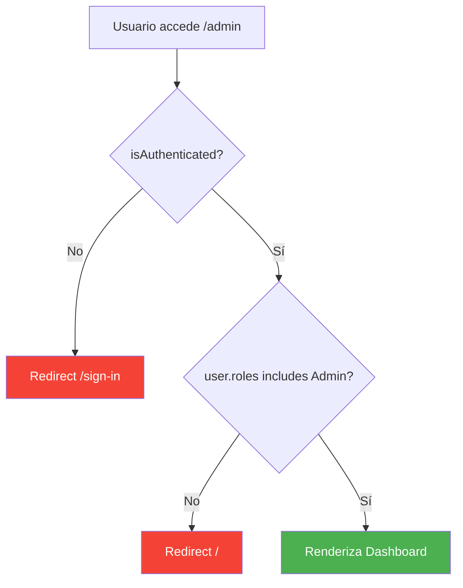

# Sky Jump Park - Frontend Documentation

Sistema de reservas para parque de trampolines desarrollado con React + TypeScript.

## 📋 Tabla de Contenidos

- [Arquitectura General](#arquitectura-general)
- [Tecnologías Principales](#tecnologías-principales)
- [Estructura de Rutas](#estructura-de-rutas)
- [Componentes Principales](#componentes-principales)
- [Gestión de Estado](#gestión-de-estado)
- [Flujos de Trabajo](#flujos-de-trabajo)
- [Casos de Uso](#casos-de-uso)
- [Instalación y Configuración](#instalación-y-configuración)

---

## 🏗️ Arquitectura General

El frontend utiliza una arquitectura de **Single Page Application (SPA)** optimizada con:

- **Lazy Loading** de componentes para mejorar el rendimiento inicial
- **Code Splitting** automático por rutas
- **Client-side caching** con React Query
- **Persistencia de sesión** con Zustand + localStorage

## 🛠️ Tecnologías Principales

| Tecnología          | Propósito                              |
| ------------------- | -------------------------------------- |
| **React 18**        | Librería UI con lazy loading           |
| **TypeScript**      | Tipado estático                        |
| **Wouter**          | Enrutamiento ligero (~1.3KB)           |
| **React Query**     | Gestión de estado del servidor + cache |
| **Zustand**         | Estado de autenticación persistente    |
| **React Hook Form** | Manejo de formularios                  |
| **Zod**             | Validación de esquemas                 |
| **Tailwind CSS**    | Estilos utility-first                  |
| **Flowbite React**  | Componentes UI (Progress, Modal)       |

---

## 🗺️ Estructura de Rutas



### Rutas Públicas

- `/` - Página principal
- `/sign-in` - Inicio de sesión
- `/sign-up` - Registro

### Rutas Protegidas (Usuario Autenticado)

- `/reservations` - Crear nueva reserva
- `/user-reservations` - Mis reservas

### Rutas de Administrador

- `/admin` - Dashboard con estadísticas
- `/users` - Gestión de usuarios

---

## 🧩 Componentes Principales

### 1. Header (Navegación)

Navegación responsive con estados adaptativos:

**Estados del Header:**

- **No autenticado**: Botones "Inicia Sesión" y "Regístrate"
- **Usuario autenticado**: Avatar + botón "Cerrar sesión"
- **Usuario Admin**: Agrega enlaces a "Estadísticas" y "Usuarios"

**Características:**

- Menú lateral deslizante para móvil
- Menú de perfil desplegable
- Indicador visual de ruta activa

### 2. Página de Inicio (Home)

Composición modular con secciones:

#### Hero

Banner principal con call-to-action "¡Reservá Ahora!"

#### Activities

Grid de 4 actividades principales:

- 🏀 Trampolines
- 🧗 Pared de escalar
- 🏰 Juegos inflables
- 🌊 Piscina de espuma

#### Schedules

Tabla de horarios operativos por día de la semana

#### Contact

- Formulario de contacto con validación Zod
- Mapa de Google Maps embebido
- Envío de mensajes con feedback visual

### 3. Sistema de Autenticación

#### Sign In

```typescript
// Validación flexible: email o username
signInSchema = z.object({
  emailOrUsername: z
    .string()
    .refine((value) => value.includes("@") || value.length >= 3),
  password: z.string().min(8),
});
```

**Flujo de autenticación:**



#### Sign Up

Validación robusta de contraseña:

- ✅ Mínimo 8 caracteres
- ✅ Al menos 1 mayúscula
- ✅ Al menos 1 minúscula
- ✅ Al menos 1 número
- ✅ Confirmación de contraseña

### 4. Sistema de Reservas

#### Calendario y Selección de Turnos

**Componente Calendar:**

- Selector de fecha con validación (solo fechas futuras)
- Carga dinámica de turnos disponibles por día
- Visualización de ocupación con barra de progreso

**Flujo de reserva:**



#### Modal de Confirmación

**Características:**

- Selector de cantidad de entradas (min: 1, max: cuposDisponibles)
- Validación en tiempo real de disponibilidad
- Cálculo automático del precio total
- Confirmación visual con animación

**Validaciones:**

```javascript
// No permitir cantidad mayor a cupos disponibles
if (count > turn.cuposDisponibles) {
  setErrorMessage(`Máximo ${turn.cuposDisponibles} entradas disponibles`);
}
```

### 5. Gestión de Reservas del Usuario

**Página protegida** que muestra reservas personales con filtros:

**Estados de reserva:**

- 🟢 **Confirmada**: Reservas futuras activas
- ⚪ **Completo**: Reservas pasadas completadas
- 🔵 **Todas**: Vista combinada

**Características:**

- Ordenamiento por fecha (más reciente primero)
- Visualización de detalles del turno
- Estado visual con badges de color

### 6. Panel de Administración

Dashboard exclusivo para usuarios con rol "Admin":

**Métricas en tiempo real:**

- 👥 Total de usuarios registrados
- 🕐 Total de turnos configurados
- 📊 Promedio de ocupación (cálculo client-side)
- 📅 Reservas del día actual

**Cálculo de ocupación promedio:**

```javascript
const ocupaciones = turns?.map((t) =>
  t.cupoMax > 0 ? ((t.cupoMax - t.cuposDisponibles) / t.cupoMax) * 100 : 0
);
const ocupacionPromedio = Math.round(
  ocupaciones.reduce((a, b) => a + b, 0) / ocupaciones.length
);
```

**Protección de ruta:**



### 7. Gestión de Usuarios (Admin)

**Componente UserCard:**

- Visualización de avatar con iniciales
- Información de usuario (nombre, email, roles)
- Botón de eliminación con confirmación

**Modal de confirmación:**

- Previene eliminaciones accidentales
- Muestra advertencia clara
- Invalida cache de React Query tras eliminación exitosa

---

## 🔄 Gestión de Estado

### Estado de Autenticación (Zustand)

Store minimalista con persistencia automática:

```javascript
const useAuthStore = create(
  persist(
    (set) => ({
      isAuthenticated: false,
      user: null,
      login: (payload) =>
        set({
          isAuthenticated: true,
          user: payload.user,
        }),
      logout: () =>
        set({
          isAuthenticated: false,
          user: null,
        }),
    }),
    { name: "auth-storage" }
  )
);
```

**Ventajas:**

- ✅ Persistencia automática en localStorage
- ✅ Sincronización entre pestañas
- ✅ API simple y predecible
- ✅ Solo 1KB de tamaño

### Estado del Servidor (React Query)

Configurado a nivel raíz con cache inteligente:

**Queries principales:**

| Query Key               | Endpoint                  | Uso                    |
| ----------------------- | ------------------------- | ---------------------- |
| `["users"]`             | GET /auth                 | Lista usuarios (admin) |
| `["turns"]`             | GET /api/turnos           | Todos los turnos       |
| `["turnsByDay", date]`  | GET /api/turnos?fecha     | Turnos por fecha       |
| `["reservationsToday"]` | GET /api/reservas/hoy     | Reservas del día       |
| `["reservations"]`      | GET /api/reservas/usuario | Reservas del usuario   |

**Configuración de cache:**

```javascript
const queryClient = new QueryClient({
  defaultOptions: {
    queries: {
      staleTime: 5 * 60 * 1000, // 5 minutos
      cacheTime: 10 * 60 * 1000, // 10 minutos
      refetchOnWindowFocus: true,
    },
  },
});
```

---

## 🔒 Patrones de Protección de Rutas

Todas las rutas protegidas implementan validación consistente:

```javascript
// Patrón estándar para rutas de usuario
useEffect(() => {
  if (!isAuthenticated) {
    setLocation("/sign-in", { replace: true });
    return;
  }
}, [isAuthenticated, setLocation]);

// Patrón para rutas de admin
useEffect(() => {
  if (!isAuthenticated) {
    setLocation("/sign-in", { replace: true });
    return;
  }
  if (!user.roles?.includes("Admin")) {
    setLocation("/", { replace: true });
  }
}, [isAuthenticated, user, setLocation]);
```

---

## ✅ Validación de Formularios

Esquemas Zod centralizados en `authSchema.js`:

### Schema Sign In

```javascript
export const signInSchema = z.object({
  emailOrUsername: z
    .string()
    .min(1, "Email o usuario es requerido")
    .refine(
      (value) => value.includes("@") || value.length >= 3,
      "Email válido o username de 3+ caracteres"
    ),
  password: z.string().min(8, "Mínimo 8 caracteres"),
});
```

### Schema Sign Up

```javascript
export const signUpSchema = z
  .object({
    userName: z.string().min(3).max(30),
    email: z.string().email("Email no válido"),
    password: z
      .string()
      .regex(
        /^(?=.*[A-Z])(?=.*[a-z])(?=.*\d).{8,}$/,
        "8+ caracteres, mayúscula, minúscula y número"
      ),
    confirmPassword: z.string(),
  })
  .refine((data) => data.password === data.confirmPassword, {
    message: "Las contraseñas no coinciden",
    path: ["confirmPassword"],
  });
```

### Schema Contacto

```javascript
export const contactSchema = z.object({
  name: z.string().min(2).max(100),
  email: z.string().email(),
  message: z.string().min(10).max(1000),
});
```

---

## 📋 Casos de Uso

### CU-01: Registro de Usuario

**Actor:** Usuario no registrado  
**Flujo principal:**

1. Usuario accede a `/sign-up`
2. Completa formulario (userName, email, password, confirmPassword)
3. Sistema valida datos con Zod client-side
4. POST a `/auth/register`
5. Auto-login automático
6. Redirect a página principal

**Validaciones:**

- Username único (3-30 caracteres)
- Email válido y único
- Contraseña segura (regex)
- Confirmación de contraseña coincide

### CU-02: Inicio de Sesión

**Actor:** Usuario registrado  
**Flujo principal:**

1. Usuario accede a `/sign-in`
2. Ingresa email/username y contraseña
3. Sistema valida credenciales
4. POST a `/auth/login` retorna token + user
5. Guarda en Zustand store + localStorage
6. Redirect a página principal

**Casos alternativos:**

- Credenciales inválidas → Mensaje de error
- Usuario no existe → Mensaje de error

### CU-03: Crear Reserva

**Actor:** Usuario autenticado  
**Precondición:** Usuario con sesión activa  
**Flujo principal:**

1. Usuario accede a `/reservations`
2. Selecciona fecha en calendario
3. Sistema carga turnos disponibles para esa fecha
4. Usuario selecciona turno con cupos disponibles
5. Abre modal de confirmación
6. Selecciona cantidad de entradas (validación vs cupos)
7. Confirma reserva
8. POST a `/api/reservas`
9. Sistema muestra mensaje de confirmación
10. Invalida cache de turnos

**Validaciones:**

- Fecha debe ser futura
- Cantidad ≤ cuposDisponibles
- Cantidad ≥ 1

### CU-04: Ver Mis Reservas

**Actor:** Usuario autenticado  
**Flujo principal:**

1. Usuario accede a `/user-reservations`
2. Sistema carga reservas del usuario
3. Usuario aplica filtro (Todas/Confirmada/Completo)
4. Sistema ordena por fecha descendente
5. Visualiza lista de reservas con detalles

**Información mostrada:**

- Fecha de reserva
- Hora del turno
- Cantidad de entradas
- Estado de la reserva

### CU-05: Dashboard Administrador

**Actor:** Usuario Admin  
**Precondición:** Usuario con rol "Admin"  
**Flujo principal:**

1. Admin accede a `/admin`
2. Sistema valida rol "Admin"
3. Carga métricas en paralelo:
   - Total usuarios (GET /auth)
   - Total turnos (GET /api/turnos)
   - Reservas del día (GET /api/reservas/hoy)
4. Calcula ocupación promedio client-side
5. Renderiza dashboard con 4 cards de estadísticas

**Protección:**

- Usuario no autenticado → Redirect `/sign-in`
- Usuario sin rol Admin → Redirect `/`

### CU-06: Eliminar Usuario (Admin)

**Actor:** Usuario Admin  
**Flujo principal:**

1. Admin accede a `/users`
2. Sistema carga lista de usuarios
3. Admin hace click en "Eliminar Usuario"
4. Sistema abre modal de confirmación
5. Admin confirma eliminación
6. DELETE a `/auth` con userId
7. Sistema invalida cache de users
8. Recarga página con lista actualizada

**Validaciones:**

- Confirmación obligatoria
- Feedback visual durante eliminación

---

## 🚀 Instalación y Configuración

### Prerrequisitos

- Node.js 18+
- npm o yarn

### Instalación

```bash
# Clonar repositorio
git clone https://github.com/lucasmquinteros/TP_Programacion_4.git
cd TP_Programacion_4/app

# Instalar dependencias
npm install

# Configurar variables de entorno
cp .env.example .env
# Editar .env con tu configuración
```

### Variables de Entorno

```env
VITE_API_URL=http://localhost:3000/api
VITE_GOOGLE_MAPS_API_KEY=tu_api_key_aqui
```

### Scripts Disponibles

```bash
# Desarrollo
npm run dev          # Inicia servidor de desarrollo (port 5173)

# Producción
npm run build        # Genera build de producción
npm run preview      # Preview del build de producción

# Linting
npm run lint         # Ejecuta ESLint
```

### Estructura de Directorios

```
app/
├── src/
│   ├── components/      # Componentes reutilizables
│   │   ├── header.jsx
│   │   ├── footer.jsx
│   │   ├── calendar.jsx
│   │   ├── turn-card.jsx
│   │   ├── confirm-modal.jsx
│   │   └── user-card.jsx
│   ├── pages/          # Páginas/rutas
│   │   ├── home.jsx
│   │   ├── signin.jsx
│   │   ├── signup.jsx
│   │   ├── reservations.jsx
│   │   ├── user-reservations.jsx
│   │   ├── admin.jsx
│   │   └── users.jsx
│   ├── services/       # Llamadas a API
│   │   ├── auth.js
│   │   ├── turns.js
│   │   └── reservations.js
│   ├── store/          # Zustand stores
│   │   └── auth-store.js
│   ├── schema/         # Esquemas Zod
│   │   └── authSchema.js
│   ├── App.jsx         # Componente raíz
│   └── main.jsx        # Entry point
├── public/             # Assets estáticos
└── package.json
```

---

## 📝 Notas Técnicas

### Optimizaciones Implementadas

1. **Lazy Loading**: Todos los componentes de página usan `React.lazy()`
2. **Code Splitting**: Bundles separados por ruta
3. **Cache Inteligente**: React Query con staleTime configurado
4. **Persistencia de Sesión**: Zustand + localStorage
5. **Validación Client-Side**: Zod para feedback inmediato

### Patrones de Diseño

- **Container/Presentational**: Separación de lógica y UI
- **Custom Hooks**: Encapsulación de lógica reutilizable
- **Composition**: Componentes modulares y componibles
- **Protected Routes**: HOC para validación de acceso

### Consideraciones de Seguridad

- ✅ Token JWT almacenado de forma segura
- ✅ Validación de roles en rutas sensibles
- ✅ Sanitización de inputs en formularios
- ✅ HTTPS requerido en producción
- ✅ CORS configurado en backend

---

## 🤝 Contribución

Este proyecto es parte del Trabajo Práctico de Programación 4.

**Repositorio:** [lucasmquinteros/TP_Programacion_4](https://github.com/lucasmquinteros/TP_Programacion_4)

---

## 📄 Licencia

Proyecto académico - UTN FRSN 2025
